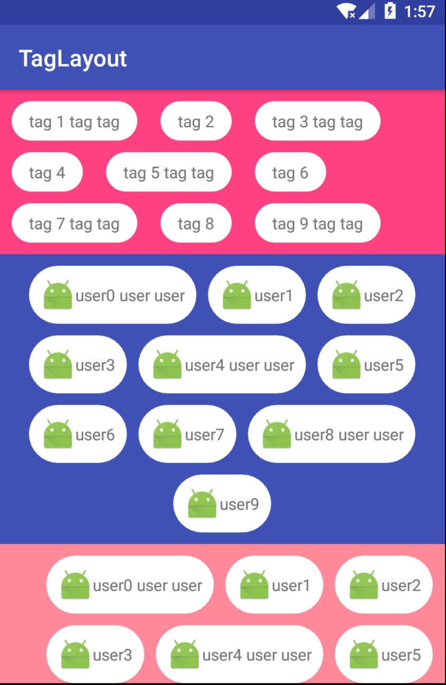

# TagLayout

a simple flowable tag layout

效果如下:


###支持三种对齐方式
* 左对齐
* 居中对齐
* 右对齐

代码里通过设置：
` tagLayout.setGravity(@GRAVITY int gravity)`来实现

xml里可以配置:

```
    <com.czc.max.taglayout.TagLayout
        android:id="@+id/tagLayout"
        android:layout_width="match_parent"
        android:layout_height="wrap_content"
        android:background="@color/colorPrimary"
        app:gravity="center_horizontal"
        android:padding="10dp"
        />
```

###添加Tag
调用 `addAllTags(List tags)` 或 `addTag(Object tag)` 方法来添加Tag


###自定义Tag
如果想实现自定义Tag，可以创建一个自定义View，不过该自定义View必须实现`ITag<E>`接口，
您需要在调用添加Tag方法前调用`setCustomTag(Class<? extends View> view)`即可。

```
public class CustomTagView extends LinearLayout implements ITag<User> {

  private TextView textView;

  public CustomTagView(Context context) {
    this(context, null);
  }

  public CustomTagView(Context context, @Nullable AttributeSet attrs) {
    super(context, attrs);
    LayoutInflater.from(context).inflate(R.layout.view_custom_tag, this, true);
    textView = (TextView) findViewById(R.id.valueTv);
    this.setBackgroundResource(R.drawable.shape_label);
  }

  @Override public void setValue(User user) {
    textView.setText(user.name);
  }
}
```


